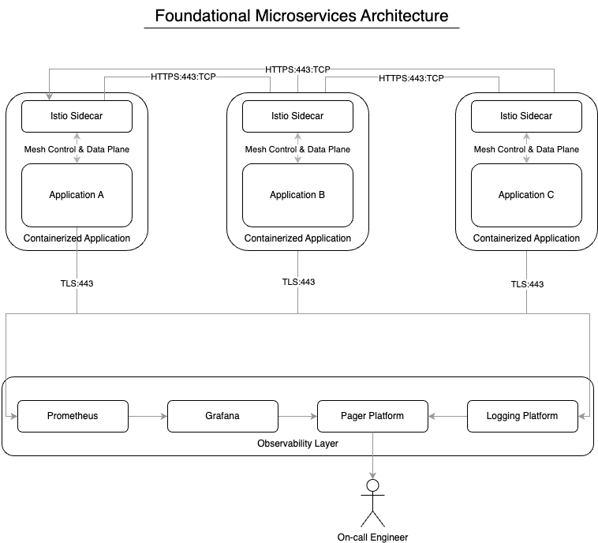

# Foundational Microservices Architecture Documentation

## Introduction
This document provides a comprehensive overview of the Foundation of Microservices Architecture, including its components, technologies, and best practices. This focuses on the infrastructure, communication, and observability. All of which lend a hand in maintaining engineering excellence. This does not cover concepts such as CI/CD, Testing, or other foundational concepts and instead focuses on the microservices architecture integrations while running in a Kubernetes environment as scale.

## Architecture

## Components

### Containerized Applications
A containerized application is a software package that contains all the necessary components to run a microservice. This includes the application code, dependencies, and configuration. We'd normally use a container orchestration platform such as Kubernetes to deploy and manage these applications. We'd also use Docker to build the container images. This is the most basic component of the architecture and alleviates the need to worry about the underlying infrastructure (essentially solves the "it works on my machine" problem). However, it can be a challenge to manage the container images and the whole ecosystem at scale, which is why we leverage the following components.

### Service Mesh
A service mesh provides a dedicated infrastructure layer for managing service-to-service communication in a microservices architecture. Often times companies chose between Istio and Linkerd. Both are great solutions and offer similar capabilities such as:

- **Traffic Management**: Enables fine-grained control over service traffic, including load balancing, circuit breaking, and fault injection for testing resilience
- **Security**: Provides automatic mTLS encryption between services, authentication, and authorization policies
- **Observability**: Offers detailed insights into service behavior through metrics, traces, and logs without requiring changes to application code
- **Policy Enforcement**: Allows implementation of rate limiting, quotas, and access controls across services

By abstracting these complex networking concerns from application code, Istio significantly reduces operational overhead and improves reliability. It acts as a transparent proxy layer, intercepting and managing all inter-service communication while providing powerful tools for monitoring and controlling the service mesh.

#### Service Registry
As part of a Service Mesh, we also get service registry. A service registry is a crucial component that maintains a catalog of all available services in the microservices ecosystem. It acts as a central repository where services can register themselves and discover other services they need to communicate with. Key aspects include:

- **Service Discovery**: Enables services to locate and communicate with each other dynamically without hardcoding endpoints
- **Health Monitoring**: Tracks the health and availability status of registered services
- **Metadata Management**: Stores additional service information like versions, environment, and dependencies
- **Consumer IDs**: Implements service-to-service authorization through unique consumer identifiers
  - Each service can be assigned a consumerId that acts as its identity
  - Access policies can be defined based on these IDs to control which services can communicate
  - Enables fine-grained access control and security at the service level
  - Helps track and audit service-to-service communications

**When combined with a service mesh, the registry provides the source of truth for service discovery while the mesh handles the actual routing and load balancing.**

### Time Series Database
A time series database (TSDB) like Prometheus is essential for storing and analyzing time-based metrics in a microservices architecture. Key benefits include:

- **Efficient Storage**: Optimized for handling time-series data with high write and query performance
  - Stores metrics with timestamps
  - Compresses data efficiently
  - Handles high-cardinality data well

- **Powerful Querying**: Provides a flexible query language (PromQL) for analyzing metrics
  - Complex aggregations and calculations
  - Range queries over time periods
  - Rate calculations and trend analysis

- **Service Monitoring**: Collects key metrics about service health and performance
  - CPU and memory usage
  - Request rates and latencies
  - Error rates and custom metrics
  - Infrastructure metrics

- **Scalability**: Designed to handle metrics from large distributed systems
  - Horizontal scalability
  - High availability options
  - Long-term storage solutions

The combination of efficient storage, powerful querying, and integration capabilities makes a TSDB like Prometheus ideal for monitoring microservices at scale.

### Data Visualization
Data visualization tools like Grafana are essential for making sense of the metrics collected by time series databases like Prometheus. Key capabilities include:

- **Real-time Dashboards**: Creates interactive visualizations of metrics data
  - Customizable graphs and charts
  - Real-time updates of service metrics
  - Drill-down capabilities for detailed analysis
  - Template variables for dynamic dashboards

- **Prometheus Integration**: Native support for Prometheus data source
  - Direct querying using PromQL
  - Automatic dashboard updates
  - Pre-built dashboards for common metrics
  - Alert visualization

- **Multi-source Support**: Can combine data from multiple sources
  - Multiple Prometheus instances
  - Other time series databases
  - Logs and traces
  - Custom data sources

- **Sharing and Collaboration**: Enables team-wide visibility into metrics
  - Shareable dashboards
  - Role-based access control
  - Annotations for incident documentation
  - Export and reporting capabilities

By pairing Grafana with Prometheus, organizations can create comprehensive monitoring solutions that make complex metrics data accessible and actionable for both developers and operations teams.

### Logging
Logging is a critical component of microservices observability, providing detailed records of application behavior, errors, and system events. Centralized logging solutions like Splunk or the ELK Stack (Elasticsearch, Logstash, Kibana) are essential for managing logs at scale. Key aspects include:

- **Centralized Log Management**: Aggregates logs from all microservices
  - Single source of truth for troubleshooting
  - Consolidated view across services
  - Historical log retention
  - Scalable storage solutions

- **Advanced Search and Analysis**: Powerful tools for investigating issues
  - Full-text search capabilities
  - Complex query languages
  - Pattern matching and correlation
  - Real-time log tailing
  - Custom dashboards and visualizations

- **Structured Logging**: Enables better analysis and querying
  - JSON formatted logs
  - Consistent log levels
  - Standard fields (timestamp, service, severity)
  - Custom metadata and context
  - Correlation IDs for request tracing

- **Security and Compliance**: Helps meet regulatory requirements
  - Access control and audit trails
  - Encrypted storage and transmission
  - Retention policies
  - Data masking for sensitive information

- **Integration Capabilities**: Works with existing tools and processes
  - API access for automation
  - Alert integration
  - Export capabilities
  - Custom plugins and extensions

Using enterprise-grade logging solutions like Splunk or Kibana ensures that teams can effectively monitor, troubleshoot, and maintain their microservices architecture while meeting security and compliance requirements.

### Logging Structure and Best Practices
A well-defined logging structure is crucial for effective troubleshooting and monitoring. Here are the key elements that should be included in every log entry:

- **Core Log Fields**: Essential information for every log message
  - Timestamp (ISO 8601 format with timezone)
  - Log Level (DEBUG, INFO, WARN, ERROR, FATAL)
  - Application/Service Name
  - Process ID
  - Thread ID/Name
  - Class/Module Name
  - Message

- **Distributed Tracing Fields**: Enable request flow tracking
  - Trace ID (unique identifier for entire request chain)
  - Span ID (identifier for specific service operation)
  - Parent Span ID (links to calling service)
  - Request ID
  - Session ID (if applicable)

### Alerting
Effective alerting is a critical component of any microservices architecture, enabling teams to proactively identify and respond to issues before they impact end users. By leveraging monitoring platforms like Grafana alongside logging solutions such as Splunk or Kibana, organizations can implement comprehensive alerting strategies.

Key aspects of an effective alerting system include:

- **Real-time Monitoring**: Continuous system observation
  - Resource utilization metrics
  - Error rate thresholds
  - Performance degradation
  - Availability checks
  - Custom business metrics

- **Alert Configuration**: Properly tuned notifications
  - Clearly defined thresholds
  - Alert severity levels
  - Alert grouping and correlation
  - Notification channels (email, SMS, Slack)
  - On-call rotation integration

- **Alert Types**: Different categories of alerts
  - Infrastructure alerts (CPU, memory, disk)
  - Application alerts (errors, latency)
  - Business metrics alerts
  - Security alerts
  - Compliance alerts

- **Alert Management**: Processes for handling alerts
  - Alert prioritization
  - Escalation paths
  - Incident response procedures
  - Alert history tracking
  - Post-mortem analysis

By combining metrics from Grafana with log-based alerts from Splunk or Kibana, teams can create a comprehensive alerting system that:
- Detects issues across all layers of the architecture
- Reduces mean time to detection (MTTD)
- Minimizes false positives through correlation
- Enables faster incident response
- Provides historical context for troubleshooting

This proactive approach to monitoring and alerting helps maintain high system reliability and user satisfaction by addressing potential issues before they become user-impacting problems.